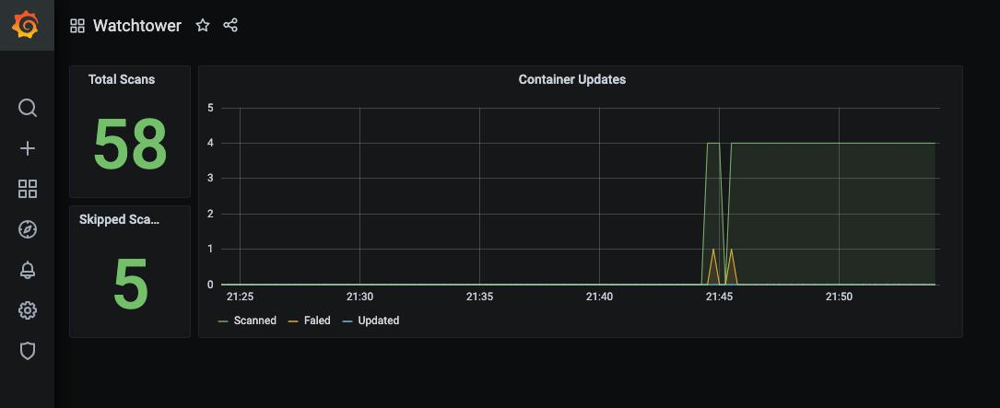

> **⚠️ Experimental feature**
> 
> This feature was added in v1.0.4 and is still considered experimental.
> If you notice any strange behavior, please raise a ticket in the repository issues.

Metrics can be used to track how Watchtower behaves over time.

To use this feature, you have to set an [API token](arguments.md#http-api-token) and [enable the metrics API](arguments.md#http-api-metrics),
as well as creating a port mapping for your container for port `8080`.

## Available Metrics 

| Name                            | Type    | Description                                                                 |
| ------------------------------- | ------- | --------------------------------------------------------------------------- |
| `watchtower_containers_scanned` | Gauge   | Number of containers scanned for changes by watchtower during the last scan |
| `watchtower_containers_updated` | Gaueg   | Number of containers updated by watchtower during the last scan             |
| `watchtower_containers_failed`  | Gauge   | Number of containers where update failed during the last scan               |
| `watchtower_scans_total`        | Counter | Number of scans since the watchtower started                                |
| `watchtower_scans_skipped`      | Counter | Number of skipped scans since watchtower started                            |

## Demo

The repository contains a demo with prometheus and grafana, available through `docker-compose.yml`. This demo
is preconfigured with a dashboard, which will look something like this:

